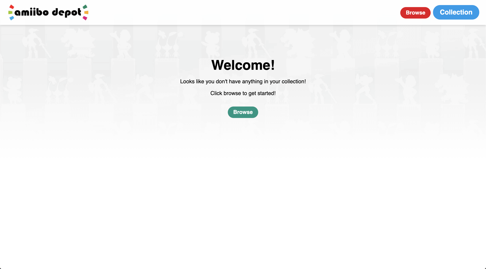
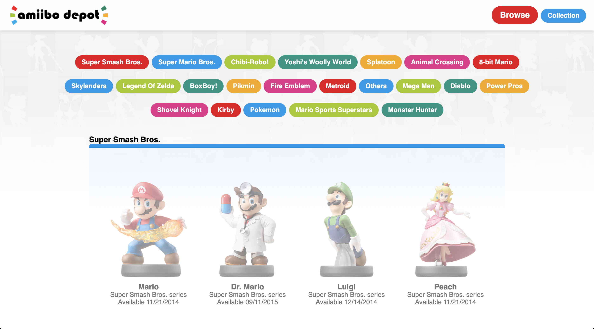
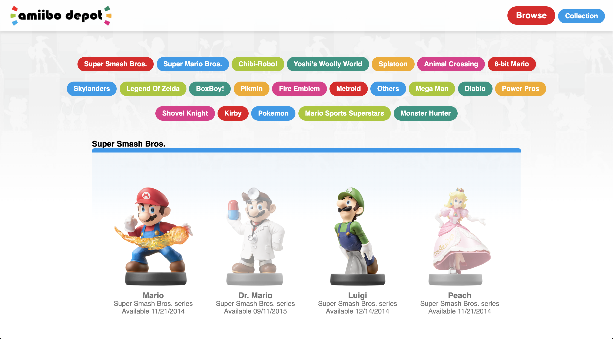
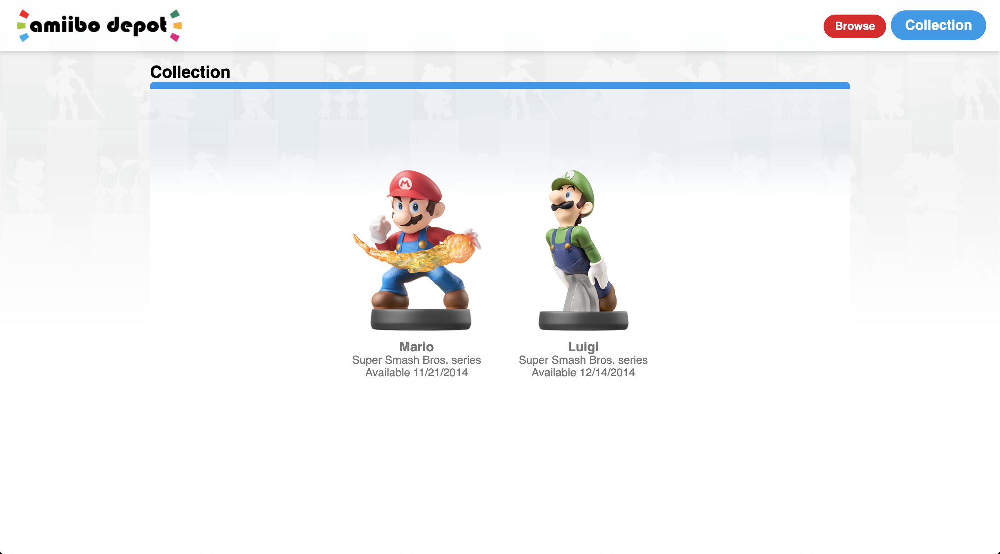

# Rancid Tomatillos
by Jonathan Tschida

## Overview

This was the final solo project assigned during Mod 3 at Turing.  We were tasked with creating web application that consumes a third party API of our choice.  This application uses the amiibo API, more information can be found at https://www.amiiboapi.com/. The application allows users to browse collectable figures by series and add them to a collection by clicking them.  The idea was to provide a tool for users to track their personal collections, though currently there is no functionality to save their data if they navigate away from the app.

The goal of this project was to demonstrate our skill with the following:
 - React fundamentals
 - React Router
 - Testing components and asynchronous JavaScript
 - Navigating a third-party API
 - Redux state management and testing

## Screenshots

## Set Up

To copy the project to your computer and run it:

1. clone down the repo using `git clone`
2. run `npm install`
3. run `npm start` to host a local server
4. your terminal should automatically navigate to [http://localhost:3000/](http://localhost:3000/), otherwise you can type it in your browser to view it.
